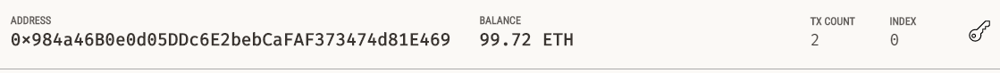
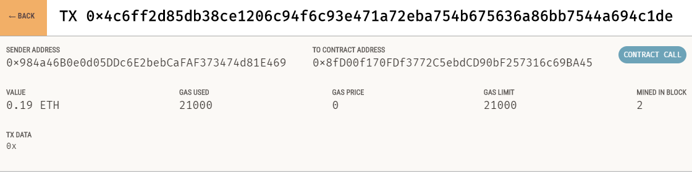
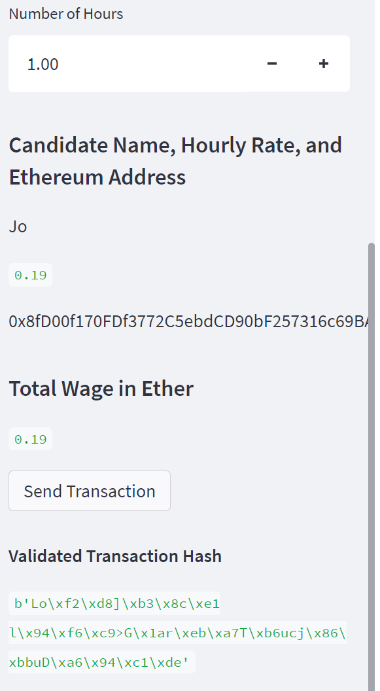
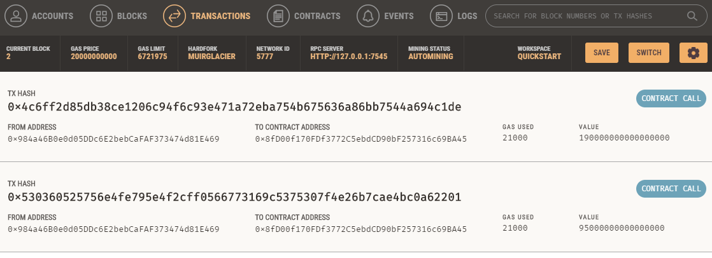

# CFB_Mod19_Challenge: Fintech Finder
This exercise creates an Ethereum Blockchain-based application that allows customers to instantly pay fintech professionals with cryptocurrency.  The application runs through Streamlit.

---

## Technologies

The application is written in Python 3.7 with support from the following packages:  

*[Pandas] (https://github.com/pandas) - Data Analysis

*[DataClasses] (https://github.com/dataclasses) - DataClasses 

*[HashLib] (https://github.com/hashlib) - Hashing

*[Streamlit] (https://github.com/streamlit) - Web Interface

## Installation Guide

Install streamlit through the command **pip install streamlit**

## Usage and Content

To use the application, pls clone the repository and run **streamlit run fintech_finder.py**.  

Here are some images from the Streamlit web interface for the ledger and validation.

Address Balance:

Transaction Example: 

Transaction Details: 

Account History:

Sender Account History:

Receiver Account History:

## Contributors
Vishnu Kurella, vishnu.kurella@gmail.com

## License
VK.LQA 2021
